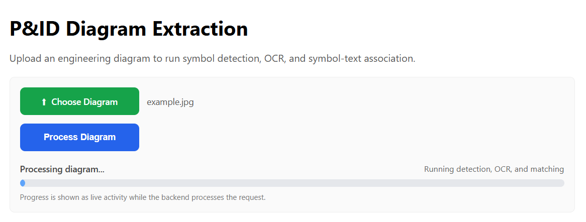
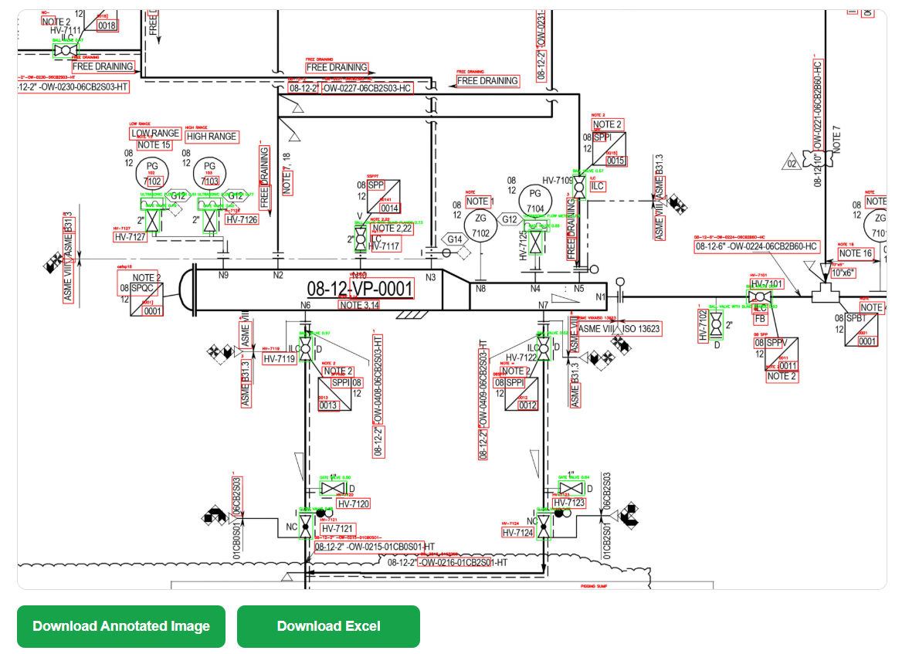
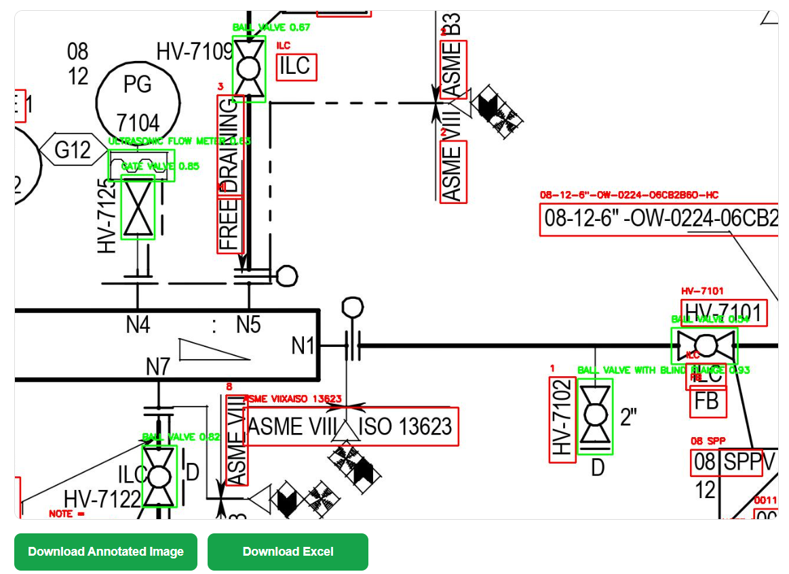
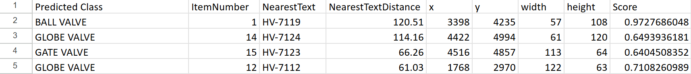

# P&ID Diagram Analysis System

A full-stack computer vision system that analyzes engineering diagrams by detecting symbols, extracting text using OCR, and automatically linking components to their corresponding labels.

The system processes raw diagram images and outputs structured data, including detected objects, extracted text, and symbol-to-text associations, with export to Excel for further analysis.

---

## Screenshots

### Upload Interface


### Processed Diagram (Annotated Output)


### Zoomed Processed Diagram


### Excel Output


---

## Example Diagrams

Sample P&ID diagrams are included in the `examples/` folder.

- `example_full.png` – full diagram input  
- `example_cropped.png` – cropped version of the same diagram  

These can be uploaded directly in the web interface to quickly test the system.

---

## Features

- Object detection on engineering diagrams (symbols, components)
- OCR-based text extraction from diagrams
- Automatic symbol-to-text association using spatial matching
- Structured data export to Excel (multi-sheet output)
- Annotated image output with bounding boxes
- Interactive web interface:
  - File upload
  - Processing feedback
  - Zoom & pan functionality
  - Download annotated image and Excel results

---

## Supported Components

The object detection model is trained to recognize common components found in P&ID (Piping and Instrumentation Diagrams), including:

- Gate valves  
- Ball valves  
- Globe valves  
- Check valves  
- Butterfly valves  
- Pressure safety valves  

Flow and equipment elements:
- Ultrasonic flow meters  
- Centrifugal pumps  
- Concentric reducers  
- Eccentric reducers  

Flanged and blind-flanged variants:
- Gate valve with flanges / blind flange  
- Ball valve with flanges / blind flange  
- Globe valve with flanges / blind flange  
- Check valve with flanges / blind flange  
- Butterfly valve with flanges  

---

## How It Works

Pipeline:

1. **Symbol Detection**  
   Detects engineering components using a custom-trained YOLO object detection model.

2. **Text Extraction (OCR)**  
   Extracts all visible text from the diagram.

3. **Spatial Matching**  
   Links each detected symbol to the nearest relevant text based on distance.

4. **Output Generation**  
   - Annotated image  
   - Excel file containing:
     - Detected Symbols
     - Detected Text
     - Symbol–Text Associations
     - Field descriptions (README sheet)

---

## Tech Stack

- **Backend:** Python, Flask  
- **Computer Vision:** YOLO (object detection)  
- **OCR:** EasyOCR   
- **Data Processing:** Pandas, NumPy  
- **Frontend:** HTML, CSS, JavaScript  
- **Export:** OpenPyXL (Excel generation)

---

## Output

The system produces:

- Annotated diagram image with detected symbols  
- Excel file with:
  - Bounding box coordinates
  - Extracted text (OCR)
  - Symbol-to-text relationships
  - Confidence scores
  - Field documentation

---

## How to Run

1. Clone the repository:

```bash
git clone <your-repo-url>
cd pid-diagram-extraction
```

2. Install dependencies:

```bash
pip install -r requirements.txt
```

or manually:

```bash
pip install numpy pandas pillow flask flask-cors openpyxl
```

3. Run the application:

```bash
py -m app.main
```

4. Open in browser:

http://127.0.0.1:5000

---

## Use Cases

- Engineering diagram analysis  
- Industrial asset documentation  
- Automated data extraction from technical drawings  
- Preprocessing for asset management systems  
- Reduces manual effort for engineers by automating symbol identification and label association in large, complex diagrams

---

## Author

Built as a portfolio project demonstrating applied computer vision, data extraction, and full-stack system design.
